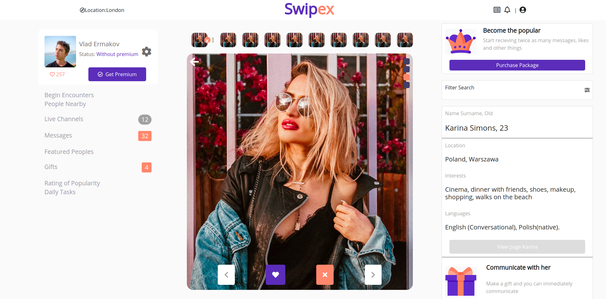

# Social Network - Swipex

>  A social network dating app Swipex built using HTML CSS 

There are three pages in both desktop and (mobile/tablet) view
 
 - main page: here the user can see his info, select a date from a list of many users and get distance and detals about her
 - chat page: here the user can see all the chats between different user
 - chat detail page: here the user can see chat details and message to a particular user.

## Built With

- HTML5
- SCSS
- CSS

## Live Demo

[Live Demo Link](https://raw.githack.com/harshdeepkanhai/social-network-capstone/feature2/index.html)
[Live Demo Chat Page](https://raw.githack.com/harshdeepkanhai/social-network-capstone/feature2/chats.html)
[Live Demo Chat Detail Page](https://raw.githack.com/harshdeepkanhai/social-network-capstone/feature2/chat-detail.html)

## Getting Started

To get a local copy up and running follow these simple example steps.

### Usage

- Clone the repo
- Run index.html

## Authors

👤 **K**

- Github: [@harshdeepkanhai](https://github.com/harshdeepkanhai)
- Twitter: [@harshdeepkanhai](https://twitter.com/harshdeepkanhai)
- Linkedin: [harshdeepkanhai](https://www.linkedin.com/in/harshdeepkanhai)

## 🤝 Contributing

Contributions, issues, and feature requests are welcome!

Feel free to check the [issues page](issues/).

## Show your support

Give a ⭐️ if you like this project!

## Acknowledgments

- Design Idea by [Vlad Ermakov] (https://www.behance.net/gallery/70285515/Swipex-This-application-for-dating)
- Inspiration
- etc

## 📝 License

This project is [MIT](lic.url) licensed.
